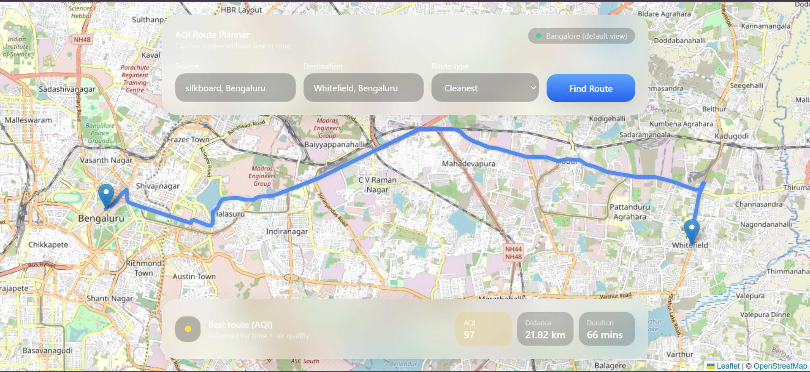
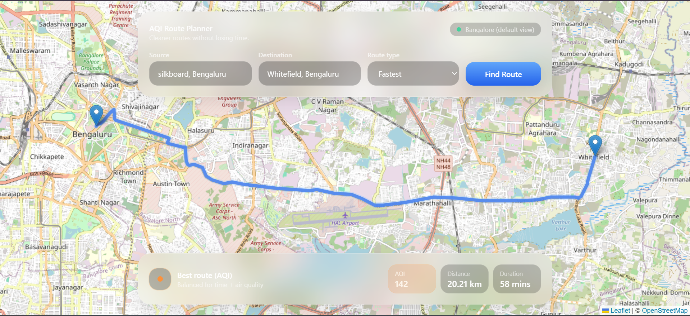

# 🌿 ClearPath — AQI-Based Route Planner

ClearPath is a smart route planning web application that helps users choose the **healthiest route** by considering air quality (AQI) along with distance and travel time.

Unlike traditional navigation apps, ClearPath allows users to select routes based on:
- 🌱 Cleanest (lowest pollution)
- ⚡ Fastest (shortest time)
- ⚖️ Balanced (optimized mix)

---

## 🧠 Key Features

- 🌍 **AQI-aware routing**
- 🗺️ **Real-time route generation using Mapbox**
- 🌫️ **Air Quality integration (WAQI API)**
- 🧮 **Custom scoring system (cleanest / fastest / balanced)**
- 📍 **Polyline-based route visualization**
- ⚡ **Optimized API usage (rate-limit safe design)**

---

## 🏗️ Architecture

### Backend (Node.js)
- Modular architecture
- Services-based design:
- **Geocoding Service** → Converts input to coordinates  
- **Maps Service** → Fetches routes from Mapbox  
- **AQI Service** → Computes pollution levels (optimized calls)  
- **Scoring Service** → Ranks routes (cleanest / fastest / balanced)

---

### 🎨 Frontend (React)

Component-based architecture with clean separation of concerns:

#### ⚙️ Frontend Flow

1. User enters source, destination, and route type  
2. `SearchPanel` triggers API request  
3. Backend returns best route + alternatives  
4. Polyline is decoded using `@mapbox/polyline`  
5. `Map.jsx` renders route using Leaflet  
6. `RouteInfo.jsx` displays AQI + route metrics  

---

## 🚀 Demo

<!-- Add your screenshot here -->

---

## 💡 UX Highlights

- Glassmorphism-based floating UI over map
- Real-time route rendering
- AQI color-coded indicators
- Minimal, distraction-free interface
- Responsive layout for different screen sizes

---

## 📦 Installation

Follow these steps to run the project locally.

---

### 1. Clone the Repository

git clone https://github.com/Shashank1-6/ClearPath-AQI-route-planner
cd ClearPath-AQI-route-planner

---

### 2. Backend Setup

cd backend
npm install

Create a `.env` file inside the `backend` folder and add:

MAPBOX_API_KEY=your_mapbox_api_key  
WAQI_API_KEY=your_waqi_api_key  
PORT=3000  

Start the backend server:

node src/app.js

---

### 3. Frontend Setup

Open a new terminal:

cd frontend
npm install
npm run dev

---

### 4. Access the Application

Frontend: http://localhost:5173  
Backend API: http://localhost:3000  

---

### ⚠️ Notes

- Ensure both frontend and backend are running simultaneously  
- Replace API keys with your own valid keys  
- Default map view is centered on Bangalore  
